# Snakee

## Brief project description

This project is based on the classic retro game called Snake. A new implementation has been created but not completed and I have been tasked with the objective to maintain and extend the re-implementation.

## How to install and run the project

### Installation:

Select device platform when downloading, to run game your machine must be up to date with Java19.

- [IntelliJ](https://www.jetbrains.com/idea/download/)
- [Java19](https://www.oracle.com/uk/java/technologies/downloads/#jdk19)

### Run Steps:

```
1. unzip the project folder
2. load IntelliJ and open the Project
3. at the top select File -> Project Structure -> Project -> SDk
4. locate your jdk-19 directory and select this
5. at the right click the maven tab
6. in this tab COMP2013-Courswork -> Plugins -> javafx -> javafx:run
7. this will run the game!
```

## How to use the project

### Start Screen

When the game first loads you will be greeted with the start screen.


On the right of the screen there are the following options:

- Playername: this will be displayed on the screen as you play and used when storing your score on the leaderboard

Dropdowns for

- Theme: this will change the player(snake), background, food objects and obstacles.
- Speed: this will change the speed that the player moves

Buttons for:


- Leaderboard : this will take you to the food , showing the top 5 players


- Start: this will start the game based on your choices

### Gameplay

- Use WASD to move the snake/pacman/spaceship.

- To grow in length and increase your score you need to eat the food objects.

- Avoid the obstacles generated as these reduce your score and length, be careful as the obstacles move often!

Depending on your theme the games player, background, food and obstacles will look different.

As you progress through the levels the target score increases as well as the spawn speed of the food and obstacle objects, good luck!

## Themes

### [Snake Theme](src/main/resources/com/Snake/images/snake)

#### Player:

<p>


</p>

#### Food:

<p>


</p>

#### Obstables:

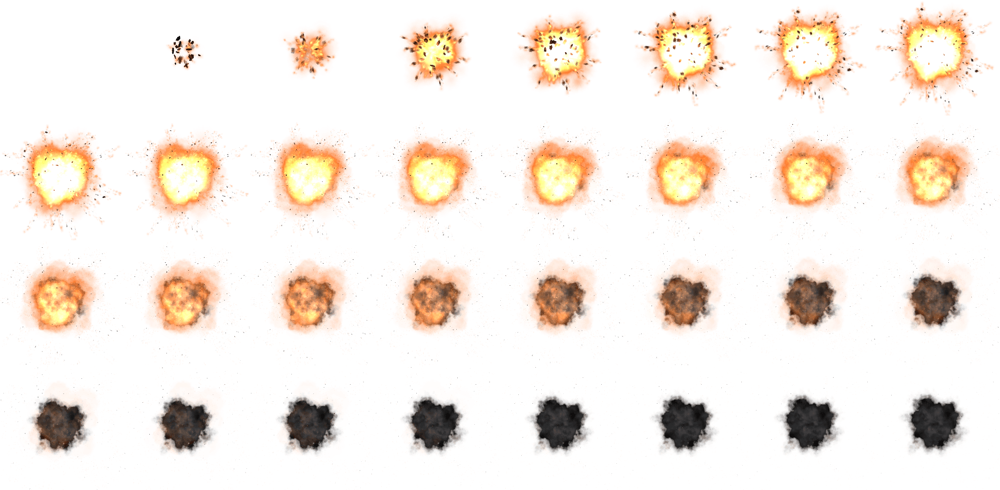

#### Background:


### [Pacman](src/main/resources/com/Snake/images/pacman)

#### Player:

<p> 
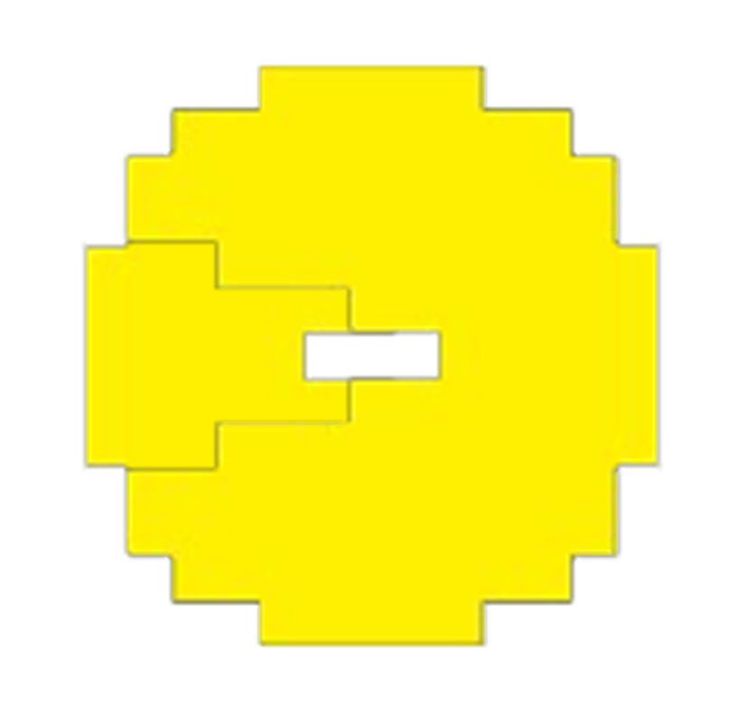


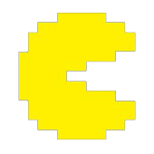
</p>

#### Food:

<p>
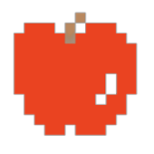
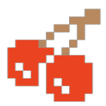
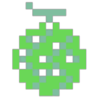
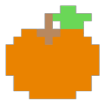
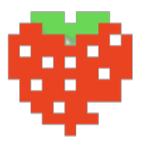
</p>

#### Obstacles

<p>


</p>

#### Background:

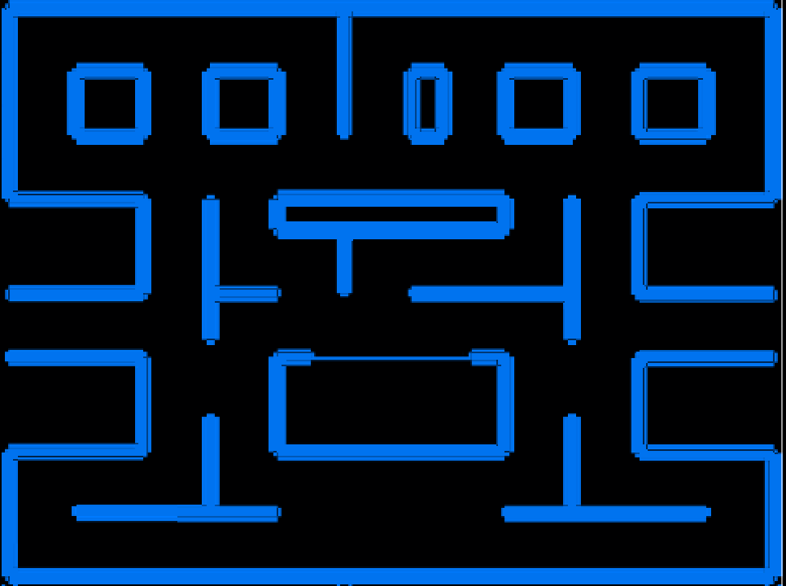

### [SpaceInvaders](src/main/resources/com/Snake/images/spaceinvaders)

#### Player:

<p>
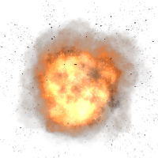


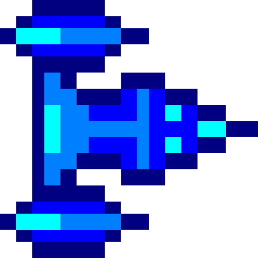
</p>

#### Food:

<p>

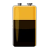


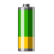
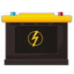
</p>

#### Obstacles

<p>


</p>

#### Background:


## Credits [if any third-party element were used]

- Intellij
- javafx
- SceneBuilder
